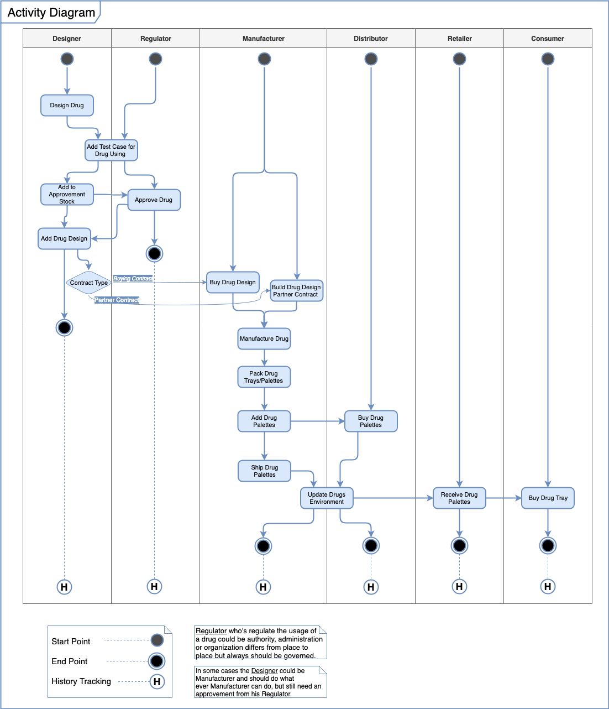
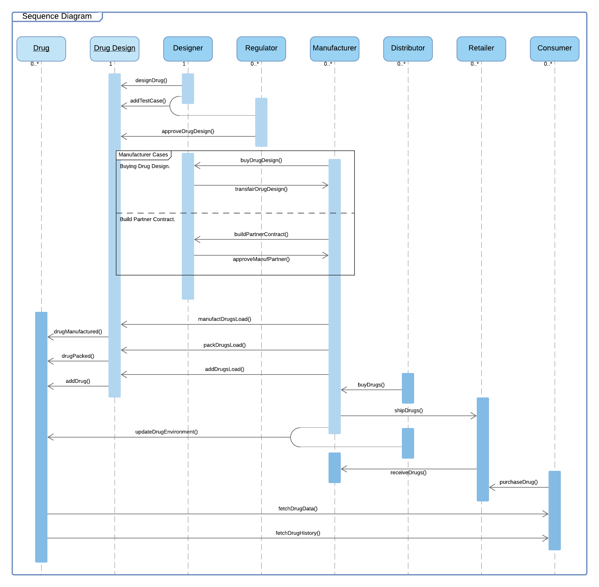
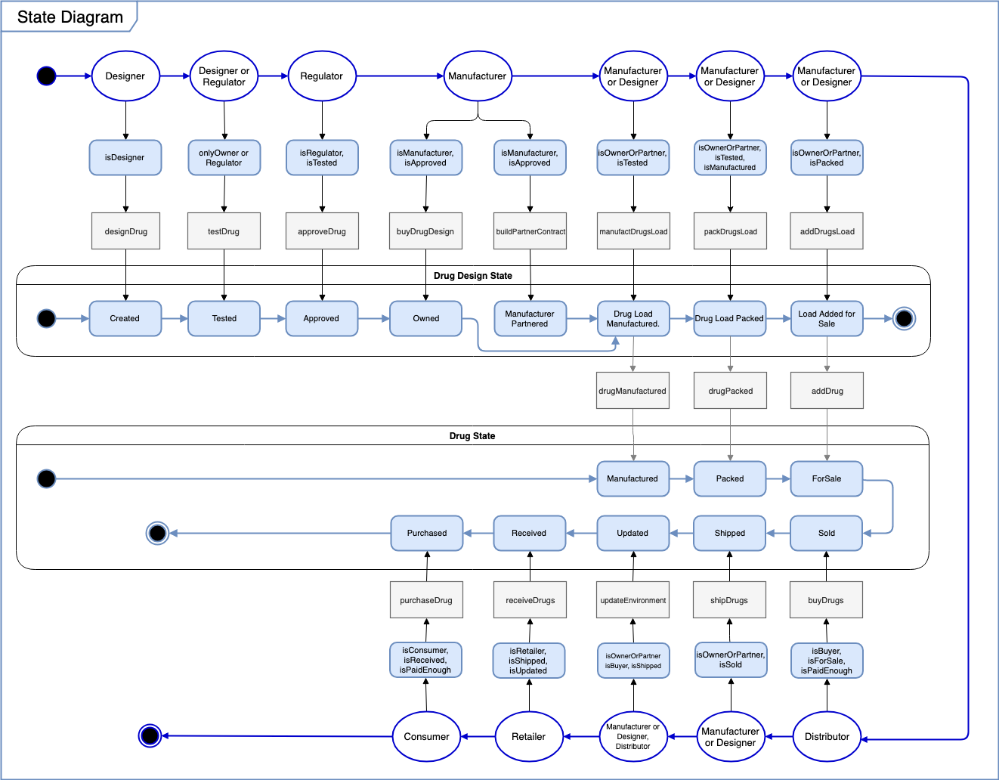
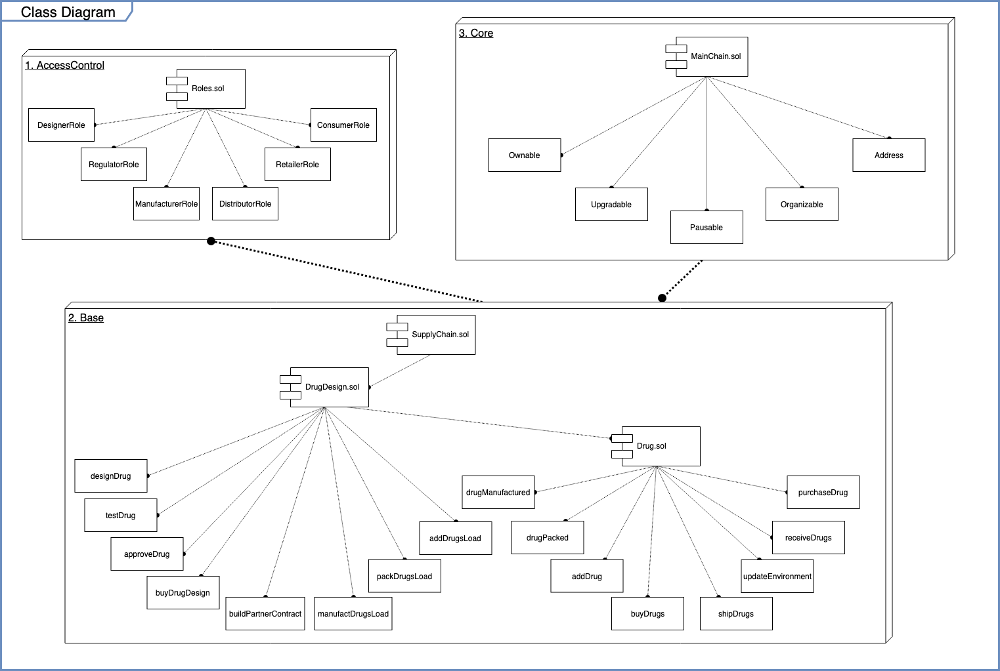

# drug-supply-chain
**under development**

## UML Architecture

### Activity Diagram

### Sequence Diagram

### State Diagram

### Class Diagram

---
## Built With ❤️ Using:
* [**Ethereum**](https://www.ethereum.org/) - Ethereum is a decentralized platform that runs smart contracts.
* [**Truffle**](https://truffleframework.com/) - development environment, testing framework and asset pipeline for blockchains using the Ethereum Virtual Machine (EVM).